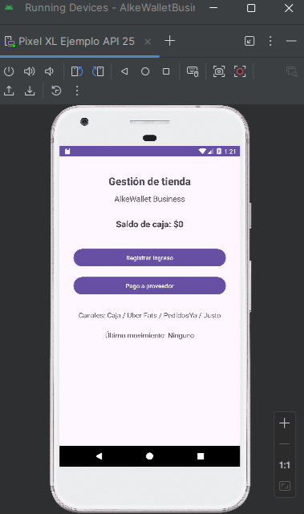
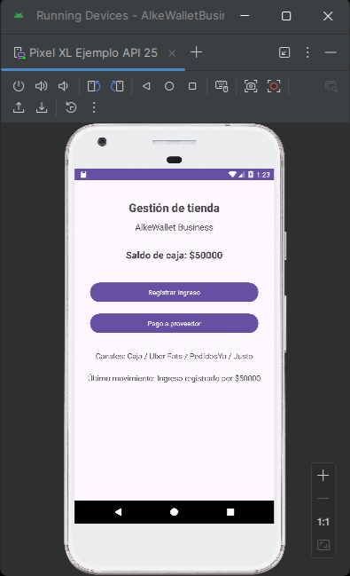
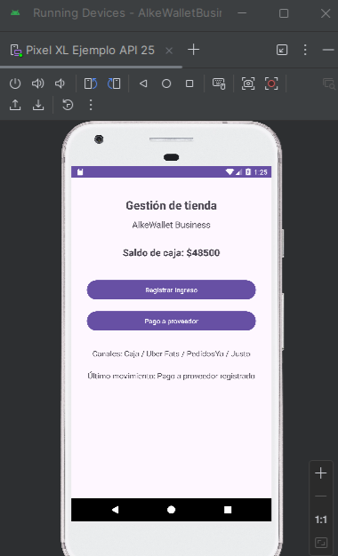

# 💼 AlkeWallet Business

Aplicación móvil desarrollada para la gestión de operaciones en un entorno de punto de venta, basada en una experiencia real en tienda del rubro alimenticio.

---

## 🧠 Contexto

Durante el trabajo en tienda, se identificó la necesidad de mejorar la organización de ingresos, egresos y control de operaciones, considerando múltiples canales de venta como:

- Caja
- Uber Eats
- PedidosYa
- Justo

Además del manejo de proveedores y promociones.

---

## 🎯 Objetivo

Desarrollar una solución móvil que permita centralizar la información y facilitar el control de operaciones diarias.

---

## 📱 Funcionalidades

- Registro de ingresos mediante ingreso de monto
- Simulación de pago a proveedores
- Actualización dinámica del saldo de caja
- Visualización del último movimiento realizado
- Interfaz simple e intuitiva

---

## ⚙️ Tecnologías utilizadas

- Android Studio
- Kotlin
- ConstraintLayout

---

## 📸 Capturas

## 🧩 Valor del proyecto

Este proyecto integra conocimientos técnicos con una experiencia laboral real, proponiendo una solución digital para optimizar la gestión de procesos en tienda.

---

## 👩‍💻 Autora

Camila Torres Reyes
